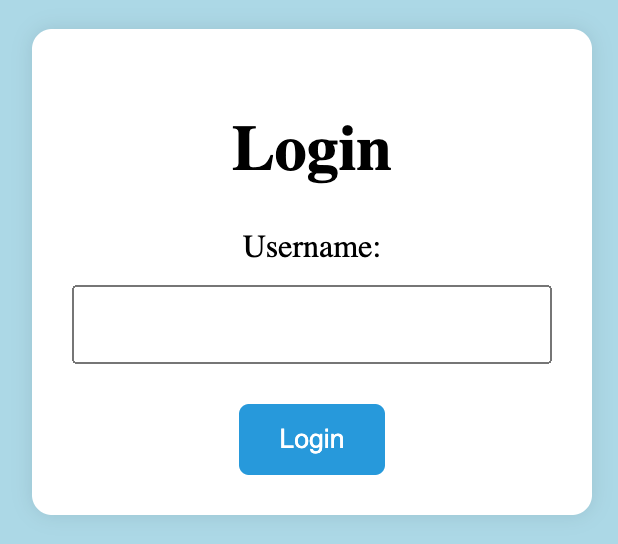
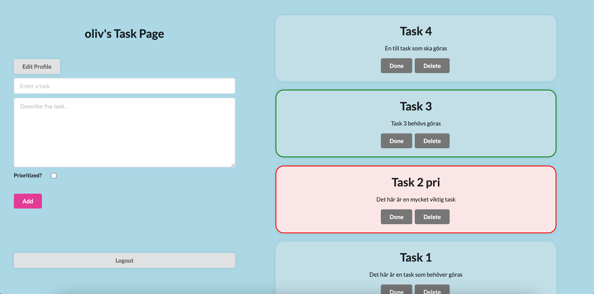
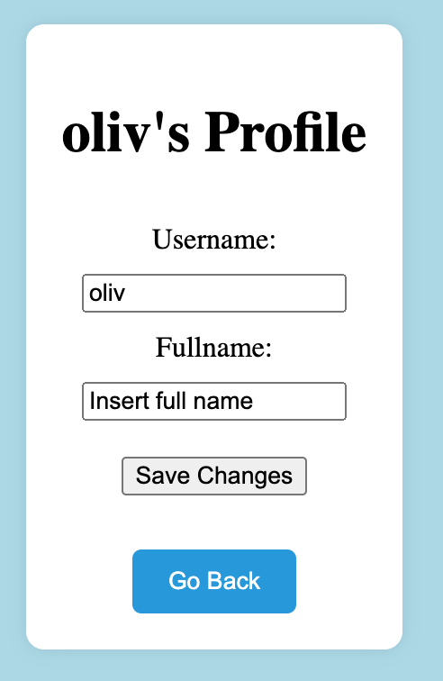
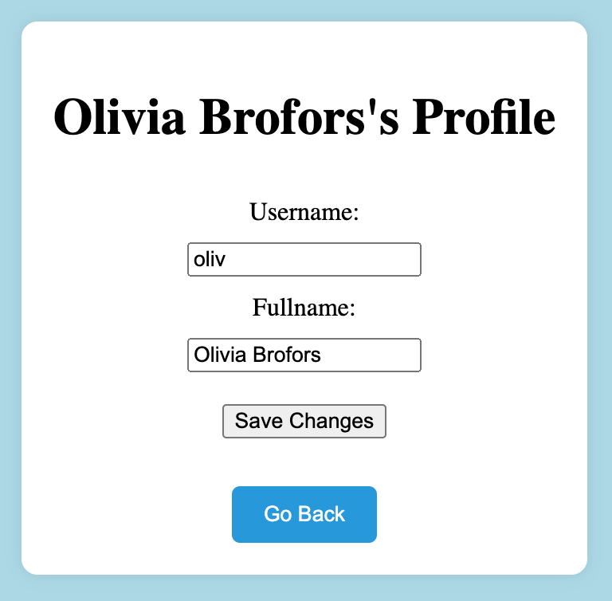

# Todo Flask App

This project implements a simple task management web application using Flask, allowing users to manage their tasks and profiles efficiently.

## Features

* **User Authentication:** Enables users to log in and manage their tasks securely.
* **Task Management:** Users can add, delete, mark tasks as done, and prioritize them as needed.
* **User Profiles:** Provides the ability to set up and edit user profiles with usernames and full names.

## Setup Instructions

1. **Clone the Repository**

    ```bash
    git clone https://github.com/your_username/todo-flask-app.git
    cd todo-flask-app
    ```

2. **Install Dependencies**

    ```bash
    pip install -r requirements.txt
    ```

3. **Database Setup**

    - Ensure SQLite is installed.
    - Initialize the database by running:

        ```bash
        python app.py
        ```

4. **Run the Application**

    ```bash
    python app.py
    ```

5. **Access the App**

    Visit [http://localhost:5000/](http://localhost:5000/) in your web browser to use the application.

## Usage

Upon accessing the application:

**Login:** Users can either log in with existing credentials or create a new account. If the username inserted in the login page already exist, you log in to that users account. If the username inserted is non-existing, a new user is created and you log in to the new users account.



**Add Tasks:** Tasks can be added by providing a title, description, and optional priority setting. If the task is prioritized it will get a red border to highlight it's importance. 

**Task Management:** Task management includes marking tasks as done or deleting them. When a task is marked done it gets a green border and when a task gets deleted it erases from the task page and from the database.



**Profile:** Users can modify their profiles by clicking on "Edit Profile". There you can change your username to a new non-existing username. You can also add a Full Name to your account. If you add a Full Name to the account the task page and profile page will be titles with "Full Name"'s page istead of "Username"'s page.

<div style="display: flex;">
    
    
</div>

## Technologies Used

This project utilizes the following technologies:

* Python
* Flask
* SQLAlchemy (SQLite)
* HTML/CSS
* Semantic UI

## Code Description

### User Authentication

* **`/login`:** Handles user authentication and session management.
* **`/logout`:** Logs the user out and redirects to the login page.

### Task Management

* **`/add`:** Adds tasks to the user's task list.
* **`/done/<int:todo_id>`:** Marks tasks as done or undone.
* **`/delete/<int:todo_id>`:** Deletes tasks from the list.

### User Profile

* **`/profile`:** Allows users to view and update their profile information.
* **`/save_changes`:** Saves changes made to the user profile.
* **`/go_back`:** Redirects the user back to the home page.

Each route in the Flask app handles specific functionalities related to user authentication, task management, and user profiles.

## Contributors

* [Olivia Brofors](https://github.com/oliviabrofors/) - Creater

## License

This project is licensed under the [GNU License](LICENSE).
